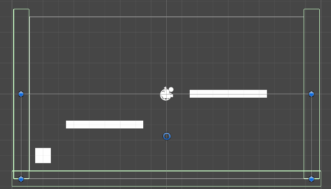

# Process Journal

## Thursday, January 23, 2025: Make a Thing

I was really stumped when trying to figure out what kind of game I wanted to make. Before I realized we had to use the engines given to us, I thought of making a “wack-a-mole” type game using javascript p5.

When looking through the different game making tools, I settled on Ink for a few reasons:

1.	I checked the basic tutorial before downloading it and the “coding” was quick and easy to understand.
2.	I enjoy writing stories, so this would be a fun exercise to test how I’d do with writing one.

Obviously, I couldn’t write an entire story, and I had to have enough to explore the main mechanics.

I decided to use the concept I had for a story where a demon king takes a human girl as a bride in order to gain control of the surface world through this union and it’s up to the girl’s best friend to save her.

I started writing with the intent of only writing a “first chapter” as a sort of way of starting a story and leaving it open ended.

I wrote up until the “pathway vs forest” choice and decided it would be easier if I make a map of all possible choices and have them meet up in certain places.

I ended up removing one of the option selections in the final product, mainly to save time for the project. I made it so that most choices get you to the same ending but still added some alternative endings to add some variety.

I wrote the rest of my text in a Google Document because it would be easy to write in my spare time. I pasted it into my file and fixed some of the coding mistakes I’ve made.

I made sure to add conditions, so that depending on the choices the player makes, the dialogue might change.

I kept my writing simple and to the point in most cases, while still adding a small twist of humor to it and making the narrator a bit sassy. If I had more time to explore this tool, I would have definitely loved to see what other choices I could give to the player. 

[Project for class](../Projects/make-a-thing)

## Thursday, January 30, 2025: Starting Unity

I had a bit of trouble when it came to recreating the exercise we did in class and adding my own twist onto it. I decided to do something simple, where the player would have to avoid the falling circles.

Because I had troubles with the school computers while trying to work in Unity, I had to start from scratch. I remembered most of the process from memory, but I had to ask for help quite a few times simply to get the base code working. I have used Unity one or twice beforehand, but never to the point where I would complete a project, much less understand when I was writing. Having worked with javascript p5 last school year, I was able to make vague connection with what I learned at the time with what I was learning now. Still, it may take me some time before I figure it out completely.

What did help me greatly were some tutorials on how to add a lives system. While it was a bit challenging for me, I was able to understand the code a little bit better. The coding wasn’t exactly what I was looking for, but I’m proud of the fact that I ended up figuring out how to have it fit with the type of game I wanted to make.

Something I’m pretty proud of was figuring out how to make the player (square) disappear. I was already given an “if” statement when the lives counter reached 0, so I had to figure out how to use Destroy(), using the coding we learned in class to do so.

Overall, even if there isn’t much to my project, I think I still found a way to make it interesting and give it a goal.

[Project for class](../Projects/testUnity/)

## Thursday, February 6, 2025: Pong (or rather, Pawng)

After we created our template it class, I already knew what I wanted to try making. I wanted to make Pong, but with four paddles instead of just two, with one paddle on each side.

In terms of my understanding of C#, I think it’s gotten better and I’m getting used to working both in VS Code and Unity at the same time (downloading a C# and Unity extension did help a lot). I didn’t ask for help this time, as I ended up solving any issues I had on my own. For example, when my top and bottom paddles were starting off at the center of the scene unlike my left and right ones, I figured out that I needed to write a different transform.localPosition for them, because they use xPos, not yPos. It seems simple in hindsight, but I’m still figuring it out.

I wanted the gameplay to be hard but still fair. Because there was a paddle on each side, the ball could not touch any of the walls. To make the stakes even higher, if the left paddle moved in one direction, the right one would be inverted (up becomes down and vice versa). Because both are connected to the same keys, you’d have to focus and remember the inversion. The same thing happens with the top and bottom paddles, but on the X axis; the top one moves left, the bottom one moves right. Originally, I had all of them move with the up and down keys, but after testing this myself, I realized that it would be too difficult to catch the ball on the paddles. So, I linked the top and bottom paddles to the A and D keys. That way, the player can use both hands to play. The blip’s pitch changes when the ball hits either the top or bottom paddle.

I thought of adding the scores, using the method I used last time for my life counter didn’t seem to be working and caused a few issues I had to fix. I hope to figure out how to add scores for each side. In the end, because each opposite side had the same controls, I made it so that Player 1 was the left and right and Player 2 was the top and bottom, which would make keeping track of all scores a little easier.

[Project for this week](../Projects/pawngFour/)

## Thursday, February 13, 2025: Breakin' Out

Due to being very busy with projects this week, I haven’t had a chance to explore a lot in Unity. I wanted to try and make the brick layer move on its own at random intervals, but I only really managed to make the layer move within a single area, kind of like it was shaking. While it wasn’t what I was trying to achieve, it actually really liked how it looked, it could make for a very interesting visual effect.

If I had more time to keep experimenting, I would try to explore how to make automated movements. I may have to use a for loop to keep it in constant motion, or rather a while loop, after you hit the spacebar to make the ball start moving. I’d like to find out how to make the movements a bit longer (and slower) too, because while the shaking is an interesting effect, I’d like for the bricks to move in a way that doesn’t make the player dizzy. Kind of like Space Invaders, but instead of the bricks moving down, left, down, right constantly, it stays in upper two thirds of the scene, moving in either direction at random, slow enough not to disorient the player too much. I’d have to put a limit to the xPos and yPos of the brick layer, so that it both doesn’t reach beyond the lower third of the screen and doesn’t fly off screen when playing.

I’d also have to set a constant speed, but an interesting idea would be to make it move a little faster with every brick you break, just as a fun challenge.

[Attempt for this week](../Projects/breakinOut/)

## Thursday, February 20, 2025: Breakin' Out Part 2

For this week, I went back to breakinOut to figure out how to make the bricklayer move. Last week, I said that I wanted to make the layer move at random, but for this week at the very least, I wanted to get the layer to move at all.

One of my classmates directed me towards Vector3.Lerp, which allowed the game object to move within a certain amount of time. It took a while for me to fully understand how it fully worked, looking through the link provided by my friend (Unity - Scripting API: Vector3.Lerp). Using a while loop in a coroutine, while the current time passing is smaller than the time it should take to move, the layer will move in a given direction. Vector3.right and its variants helped me a lot when it came to understanding what to put within the Vector3.Lerp parentheses. Before the loop, I reset the timeElapsed back to 0 and start a new coroutine after the loop.

In the end, I managed to make it loop left and right, and I had it move up and down as well. While it does move in a certain pattern instead of at random like I intended to try last week, I’m proud of what I made, even if it is minor. I’d like to explore more ways to incorporate movement done by the program in my future projects.

As an extra thing to add to the program, I wanted to add Text to the game over screen. For some strange reason, however, it didn’t seem to work. I used the technique I used for my testUnity project to display lives, but it didn’t work. The text was white and was within the scene. I used a few other techniques as well, but still to no avail. It might be something I’ve overlooked/forgotten or simply a problem with my computer.

[Project for this week](../Projects/breakinOutTwo/)

## Thursday, March 6, 2025: Prototype Iteration Process

When I originally sat down to come up with a concept for my final project, I had thought of making a fighting game in the same vein as Mortal Kombat. However, even though I’ve managed to gain a bit more experience, I knew it would still be an ambitious project to make. Therefore, I thought of making a platformer. 

While platforming games can be a lot of fun, I find that they can be lackluster depending on their goal, layout and feel. A few weeks ago, I went on a website to play old flash games from my childhood. I managed to stumble upon an old The Amazing World of Gumball game, School House Rush. While the mechanics were a little clunky, it was excusable considering they were converted from Flash. The main problem was that there was no clear goal and limited ways to defend against enemies. Vague instructions mixed with long levels don’t really make people want to play through the game to see the next level. The main collectables are suns, which serve no purpose than to simply being collected, and the invisibility frames are nearly nonexistent, making you incredibly vulnerable.

There are a few main things I want to consider when making a platformer:

1.	Anything that you can collect has a purpose for the player
2.	There is a fair balance number of enemies and/or obstacles
3.	Allow the player to get rid of enemies

In order to make things a little more interesting, I thought of incorporating the shoot-em-up concept we learned prior to our reading week. This would give players a chance to fight back against their enemies. It would also help the game feel a little more interactive rather than having the character simply run and jump. The movement buttons (left and right) would be controlled with one hand while the jumping and shooting buttons would be controlled with another. These could be subject to change. I am also considering a crouch button, which could possibly allow the player to duck under projectiles. Collectables would give the player temporary buffs, besides the usual health collectable. Possible ideas include increased speed, a spread shot and higher jumps. Enemies would cause damage when the player collides with them. They’d move back and forth in an area, or perhaps even follow the player. Other enemies would be able to launch projectiles at the player which would allow the players to dodge.

The one thing I’m having trouble with is figuring out is the goal. I’m considering adding leavers or switches that the player needs to find in order to open the exit, giving them a reason to progress in the game.  

### Extra Credit
No Straight Roads is a Malaysian indie game developed by Metronomic, released in 2020. What originally drew me to the game was a unique art style paired with strong saturated colours. However, what truly drew me into the game was the music, and the role it plays with the gameplay.

The gameplay revolves around you fighting bosses to conquer the next area of Vinyl City. The bosses attack you to the beat of the music, so not only do you need to pay attention to the attacks being launched towards you, but you are essentially forced to listen to the music to prevent being hit. This may be the main mechanic for you to pay attention to too in boss fights, but there are other great moments where music is utilized. Each boss has a “base” variant of their theme. When they have the upper hand on you, the theme will switch to an EDM rendition of their theme. Conversely, if you gain the upper hand, the theme switches to rock. No matter how well you did, the rock variation will play towards the end of the boss battle when you deal the final blow.

During the game, you can switch between the two main characters: Mayday, a heavy hitter who wields a guitar, and Zuke, a drummer with quicker attacks and more combo potential. Their instruments reflect their playstyle very well. Both characters can transform props on a boss’s stage by holding a button. However, depending on who you play as in the moment, the prop will differ. Mayday typically transforms props into turrets that target the boss. Zuke’s however, differs with each stage. In one stage, it’s a shield, while in another, it turns moving attacks into projectiles. This makes the player think about which character they should choose depending on the situation. A slight bonus is that while pressing the button to transform, the character you are currently playing as will perform a solo to the beat of the music ALREADY PLAYING in the background, which just shows how much effort was put into this project.

Strategy and timing would be an interesting concept to apply to a future project, but with how much I know currently, it would take a lot of time to apply in a way that would feel fun for players and not like unfair or even tedious.

One of its major downsides, however, is the two-player mode. The game is played in a third person perspective, which isn’t unusual for games like these. However, the game displays both players on the screen at once instead of a traditional split screen. While I can see why they did this from an artistic perspective, it becomes detrimental to the gameplay experience. The camera only follows the player that is furthest from the camera for some strange reason. I’m assuming because the developers didn’t bother changing it from single-player mode, where the character you control moves faster that the other, which is only programmed to follow you until it’s their turn. This makes moving around, especially the platforming sections before boss fights, incredibly frustrating. This often leads to one player being left offscreen and having either the player followed by the camera find them, of having the offscreen player scramble to find their way back, all while getting damaged by attacks they cannot see. If the camera followed the person closest to the screen or rather “zoomed out” to show the screen and accommodate both players, it would have been much more enjoyable as a shared experience.

## Thursday, March 13, 2025: First Prototype Iteration
For my first prototype iteration, I wanted to focus on making the player character move and jump, and land on platforms.

While it was easy to get my player character to move, as it’s something we’ve done before. I made sure to add a “floor” to the project, which was just an empty game object with a Box Collider 2D component. Because the player character will have a Rigidbody 2D component, I needed them to have something to land on after jumping. I wasn’t exploring how to move the camera just yet, so I placed a left and right wall (also an empty game object with Box Collider 2D) so that the player stayed within the camera confines. 

The tricky part was getting them to jump.

I originally tried using the same technique to move left and right for the jumping mechanic, but nothing worked. A friend of mine recommended looking at AddForce to make my character jump, which I found on the [Unity Documentation site](https://docs.unity3d.com/6000.0/Documentation/ScriptReference/Rigidbody.AddForce.html). I originally made the speed the same number as the one provided in the example before changing it to a much higher number. I also changed GetKey() to GetKeyDown(), so that the player only jumps once when the jump key is pressed. While the jump does work, paired with the left and right movement, it feels a little clunky. I may need to explore more about the physics of the Unity engine.

I also managed to create platforms for the player to land on, manipulating the square sprite’s shape and again using Box Collider 2D, where the player can land on a platform and jump to the next successfully.

Next time, I will be looking at adding the shooting mechanic making the camera move, as well as look over the jumping mechanic again to make the controls more fluid.

[Prototype for this week](../Projects/Prototype01/)

